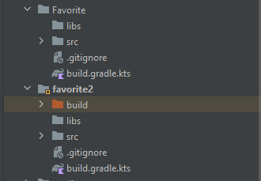
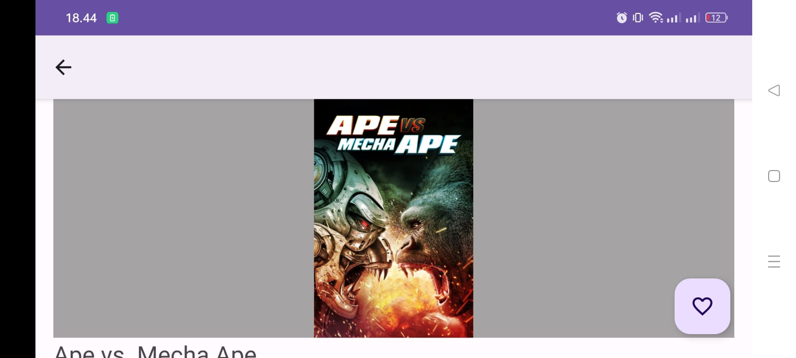

# Technical Exercise Result (Android 1)

### Project name: Submission Submission1_PokeApi

## Project Summary

- Folder Favorite memiliki konten yang tidak digunakan sehingga sebaiknya dihapus untuk mengurangi penggunaan memori.
- Penggunaan import yang tidak diperlukan sebaiknya dihapus. Kamu bisa memanfaatkan fitur Problems > File untuk mengecek semua warning terkait penggunaan kode yang tidak diperlukan pada file terkait
- Sebaiknya gunakan versi terbaru dari setiap dependensi dan plugin yang digunakan sesuai dengan best practice yang disarankan
- Hindari penggunaan Hardcoded String, anda dapat manfaatkan Android String Resource.
- Perhatikan penggunaan layout dan desain tampilan yang digunakan sehingga tidak mengganggu experience pengguna saat menggunakan aplikasi anda.
- Kode yang tidak pernah digunakan baik itu Class, method, ataupun variable jika tidak digunakan sebaiknya dihapus. Kamu bisa memanfaatkan **Analyze - Code Cleanup** untuk melakukannya dengan cepat.
- Penggunaan namespace aplikasi sebaiknya disesuaikan sehingga memiliki makna yang lebih tepat.
- Anda dapat mengubah ikon aplikasi yang anda gunakan sehingga tampilan aplikasi menjadi lebih menarik.

## Code Review



> Folder Favorite memiliki konten yang tidak digunakan dalam fitur manapun pada aplikasi sehingga sebaiknya dihapus karena dapat mempengaruhi penggunaan memori dan performance aplikasi
> 



> Pada Halaman Detail Movie layout halaman masih terpotong saat orientasi diubah menjadi landscape. Anda dapat menggunakan Scroll View Layout pada halaman detail agar dapat menampilkan informasi dengan baik saat orientasi diubah menjadi landscape.
> 

```kotlin
...
implementation ("androidx.room:room-rxjava2:$roomVersion")
api ("androidx.lifecycle:lifecycle-reactivestreams-ktx:$rxLifecycleVersion")

api ("androidx.activity:activity-ktx:$activityKtxVersion")
api ("androidx.fragment:fragment-ktx:$fragmentKtxVersion")
...
```

> Selalu gunakan versi terbaru dari Kotlin Plugin dan dependensi yang anda gunakan agar kode yang Anda tuliskan sesuai dengan best practice yang disarankan. Silahkan update versi plugin dan dependensi yang anda gunakan pada file **build.gradle**.
> 

```kotlin
val uri = Uri.parse("submission1_pokeapi://favorite")
```

> Kode yang tidak pernah digunakan baik itu Class, method, ataupun variable jika tidak digunakan sebaiknya dihapus. Kamu bisa memanfaatkan **Analyze - Code Cleanup** untuk melakukannya dengan cepat.
> 

```kotlin
android:text="Ini Judul Movie"
```

> Penggunaan Hardcoded String sebaiknya dihindari, gunakan Android Resource String sesuai dengan best practice yang disarankan. Dengan demikian aplikasi dapat menggunakan fitur translate dengan lebih mudah untuk mengubah teks tersebut ke bahasa lain.
> 

```kotlin
...
import retrofit2.Call
import retrofit2.Callback
import retrofit2.Response
...
```

> Penggunaan import yang tidak diperlukan sebaiknya dihapus. Kamu bisa memanfaatkan fitur Problems > File untuk mengecek semua warning terkait penggunaan kode yang tidak diperlukan pada file terkait
> 

```kotlin
namespace = "com.dokari4.submission1_pokeapi"
...
applicationId = "com.dokari4.submission1_moviedbapi"
...
```

> Penggunaan namespace aplikasi sebaiknya disesuaikan sehingga memiliki makna yang lebih tepat karena aplikasi tidak menggunakan pokeapi di dalam pengerjaannya.
>